# Fairline Unitset for Unciv

Unit images for [Unciv](https://github.com/yairm210/Unciv) from the [Civ II Scenario League](https://sleague.civfanatics.com), [Fairline](https://forums.civfanatics.com/members/fairline.14395/), and others. Targets unitsets for Civ IV, V, VI, and Rekmod.

## Usage

1. Run Unciv
2. Open the Mods menu
3. At the top right, expand and search for "Fairline"
4. Select Fairline and download it
5. Enable "Permanent audiovisual mod"
6. In Options > Display, select the Fairline Unitset
7. In Options > Display, set "Unit Icon Opacity" to 0%

## Units

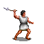 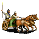    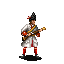 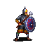    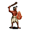  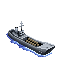  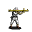  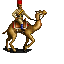       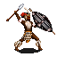           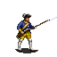    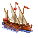        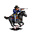 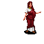   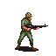  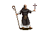  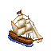       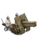  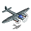 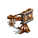   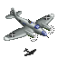 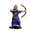   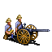        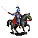   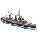 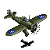               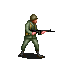  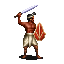    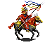 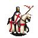 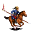               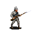     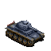            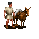   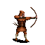 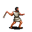     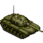  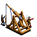     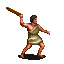        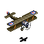 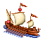            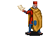      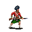                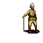         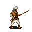          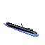                                         

## Roadmap

- [ ] Add all [missing units](Units.md)
- [ ] Fill in nation colours for [each unit](Units.md)
- [ ] Ensure all units are in the correct position
- [ ] Review the units to see if there are better options
- [ ] Add nation-specific unit sets
- [ ] Add Alpha-transparent shadows for each unit

## Development

1. Use git to clone the repository to your mods directory
1. Acquire one of the unit sets at the [Civ Scenario League](https://sleague.civfanatics.com)
2. Make sure the image has an alpha transparent layer
3. Use Aseprite to extract the sprite sheet with "Replace Color"
4. Split the image to sprites using "Import Sprite Sheet"
    - X: 1
    - Y: 1
    - Width: 64
    - Height: 64
    - Padding with H 1 V 1
4. Create the `Unit-1.png` for the primary colors, and `Unit-2.png` for highlights
    - To shift the colors, use Edit -> Adjustments -> Hue/Saturate
5. For nation-specific units, use `Unit-Egypt.png`
6. Discuss [the mod on Discord](https://discord.com/channels/586194543280390151/1305371564044456046)

## Credits

- [Civilization II Scenario League](https://sleague.civfanatics.com)
- [Fairline](https://forums.civfanatics.com/members/fairline.14395/#about)
- [Tanelorn](https://forums.civfanatics.com/members/tanelorn.22178/)

Thank you to the whole Civ Scenario League for [permission for the art use](https://forums.civfanatics.com/threads/best-scenarios-of-all-time.692842/#post-16703990).
